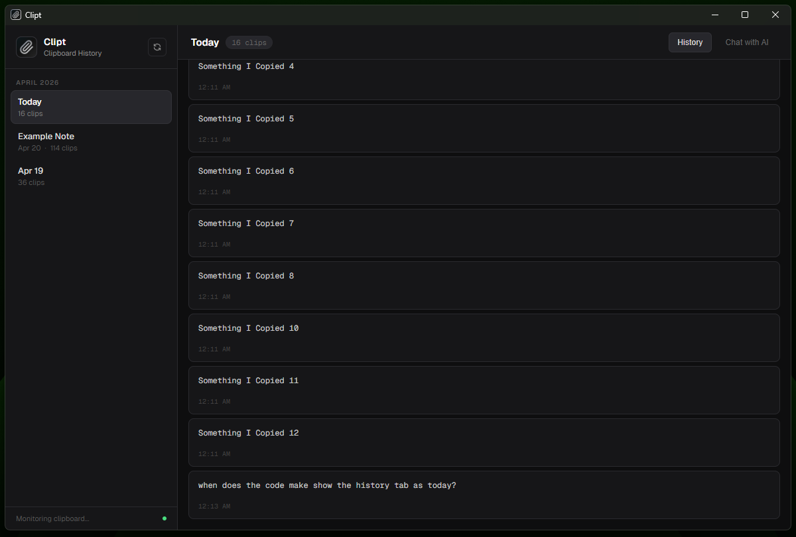
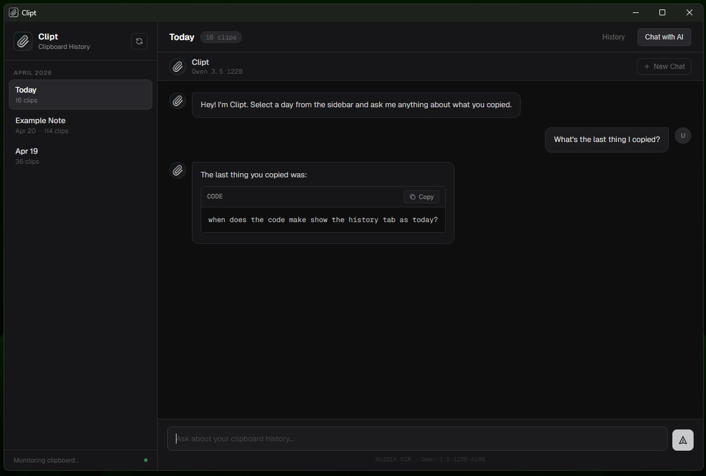

<div align="center">
  
  <h1>Clipt</h1>

  <p><strong>Clipboard history manager with AI search</strong></p>

  <p>
    
    
    
    
  </p>
</div>

---

Clipt runs in your system tray. It records everything you copy, organizes snippets into daily databases, and lets you search or chat with your history.

## Screenshots

<table>
  <tr>
    <td align="center"><br/><sub>Daily history</sub></td>
    <td align="center"><br/><sub>Chat with your clipboard history</sub></td>
  </tr>
</table>

## What it does

**Clipboard monitoring**
- Captures everything you copy
- Closes to the system tray, keeps recording
- Writes to your clipboard without flashing terminal windows

**Storage**
- Daily folders: `/Days/YYYY-MM-DD/`
- One SQLite database per day
- Data stays on your machine

**AI chat**
- Uses Qwen 3.5 (122B) via NVIDIA NIM
- Handles your entire day's history in one conversation
- Renders Markdown: code blocks, bold text, lists

**Interface**
- Dark mode with silver borders
- Light on system resources

## Where data lives

| Platform | Path |
| :--- | :--- |
| **Windows** | `%APPDATA%/Clipt` |

The folder contains your `Days/` archive and `.env` configuration. Clipt does not send your clips to the cloud.

## Command line

| Argument | Effect |
| :--- | :--- |
| `--startup` | Launches to system tray without opening a window |

## Install

**Requirements**
- [Python 3.12](https://www.python.org/)

```bash
git clone https://github.com/noahain/clipt
cd clipt
py -3.12 -m pip install -r requirements.txt
py -3.12 main.py
```

## Build executable

```bash
py -3.12 -m PyInstaller Clipt.spec --clean
```

The `.exe` appears in `dist/`. The build bundles `icon.ico` and `icon.png` for taskbar and tray scaling.

## Development team

- **Lead:** Noahain — product design, Python lifecycle
- **Primary developer:** Claude Code (Kimi K2.5) — SQLite, clipboard monitoring, `pywebview`
- **Technical consultant:** Gemini 3 Flash — architecture, visuals, cross-process communication

## Tech stack

Python 3.12 · `pywebview` · SQLite · PowerShell · NVIDIA NIM · Qwen 3.5 (122B)

## License

MIT

---

<div align="center">
  Built with ❤️ and AI
</div>
